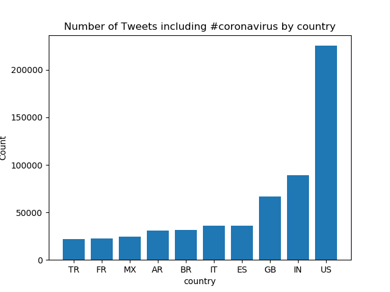
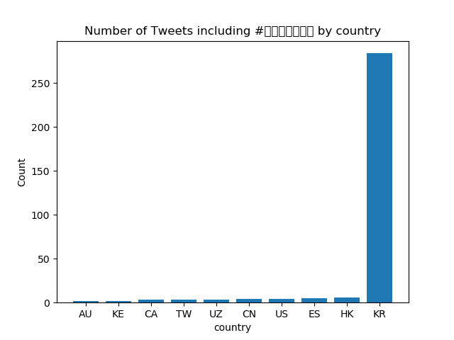
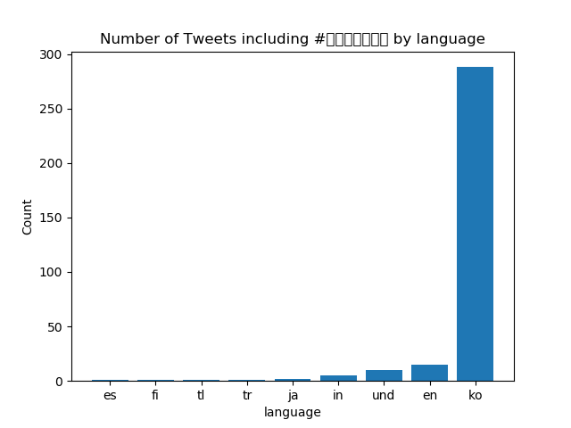

# Coronavirus Twitter Analysis Project

## Project Overview

This project analyzes the spread of the coronavirus conversations on Twitter by processing geotagged tweets from 2020. With approximately 1.1 billion tweets in the dataset, the project tracks the usage of coronavirus-related hashtags.

## Objectives

- Handle large-scale datasets: Analyzing over a billion tweets to understand global discussions.
- Work with multilingual text: Tweets are in numerous languages, necessitating an approach that can handle linguistic diversity.
- Utilize MapReduce: Implementing MapReduce for parallel data processing to improve efficiency.

## Methodology

- **Map**: Process individual day's tweets to count occurrences of hashtags, segregated by language and country.
- **Reduce**: Aggregate daily counts to compile a yearly overview.
- **Visualize**: Generate graphs to visually represent the distribution and trends of hashtag usage.

## Results

The analysis produced several visualizations:

1. Frequency of `#coronavirus` by country.
2. Frequency of `#coronavirus` by language.
3. Frequency of `#코로나바이러스` by country.
4. Frequency of `#코로나바이러스` by language.
5. Line plot of selected hashtags (#coronavirus, #코로나바이러스, #covid-19) usage throughout the year.

### Visualizations

An `alternative_reduce.py` script was also developed for a comparative line plot:

## Conclusion

This project demonstrates the capability to manage and analyze large, multilingual datasets and apply parallel processing techniques to extract meaningful insights, particularly regarding the global discourse surrounding the coronavirus pandemic.

